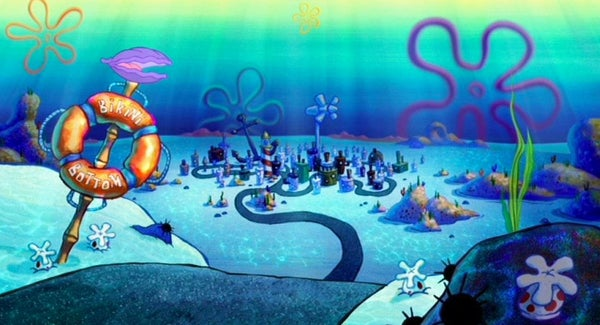

	

## Welcome 🏝️

I'm Kylan Duncan, a full stack engineer. I specialize in web development, and I'm always looking for opportunities to improve my skillset by creating new applications and refining my craft.

## Primary Tech Stack 📚

**Languages**

**Technologies**

## Connect With Me 🌐

    
    
    
    <!-- <a href="https://twitter.com/username" target="_blank"> -->
        
    <!-- </a>  -->
    <!-- <a href="https://instagram.com/username" target="_blank"> -->
        
    <!-- </a>  -->

## Check Out 👀

    
    

